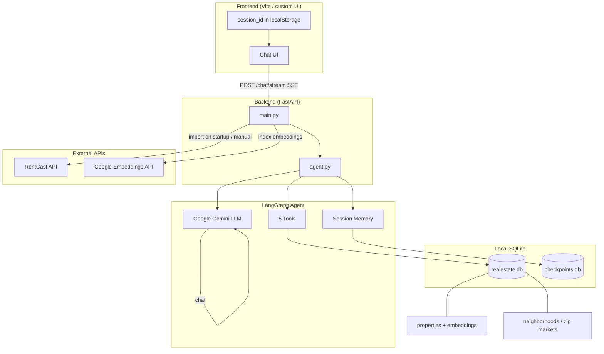
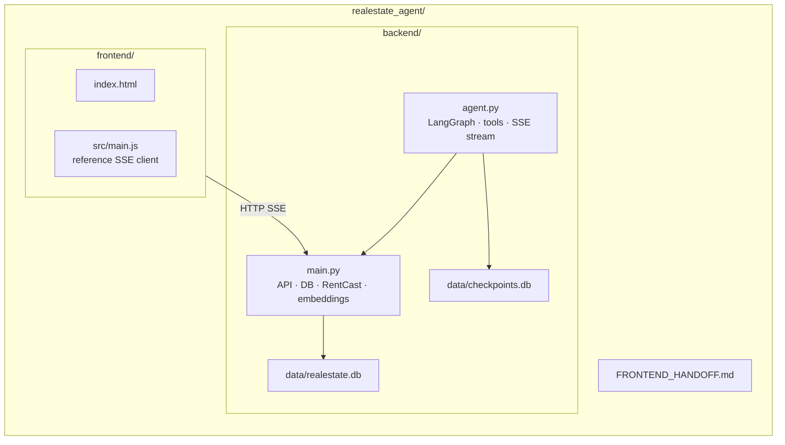
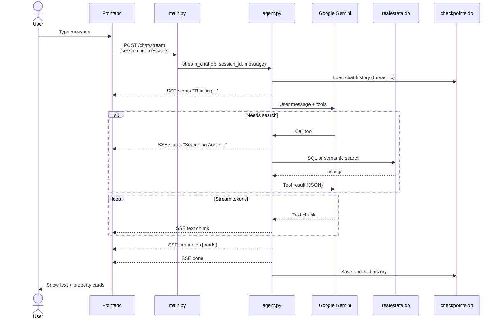
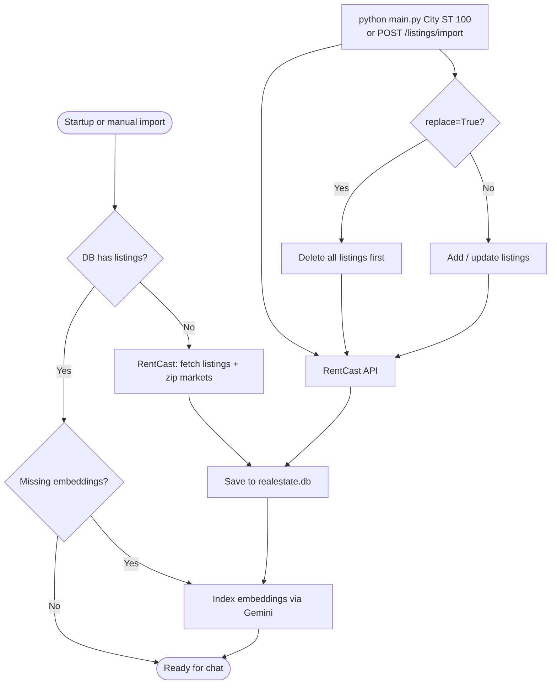
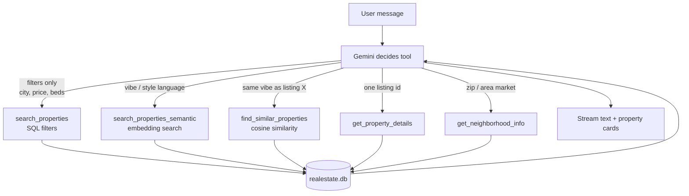
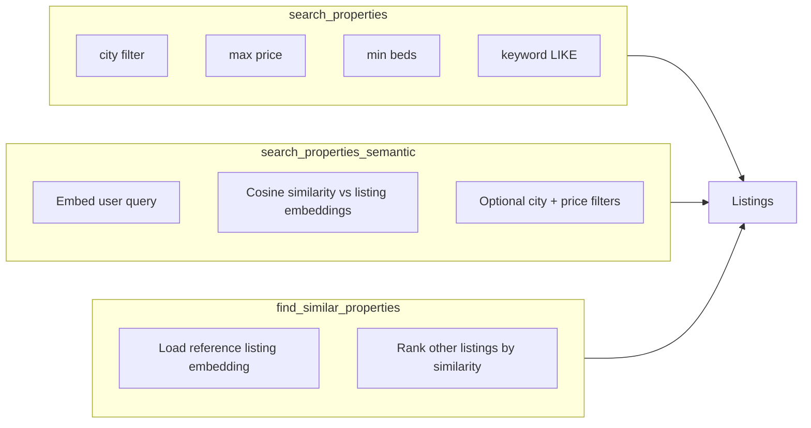
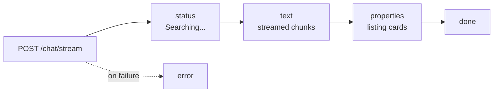
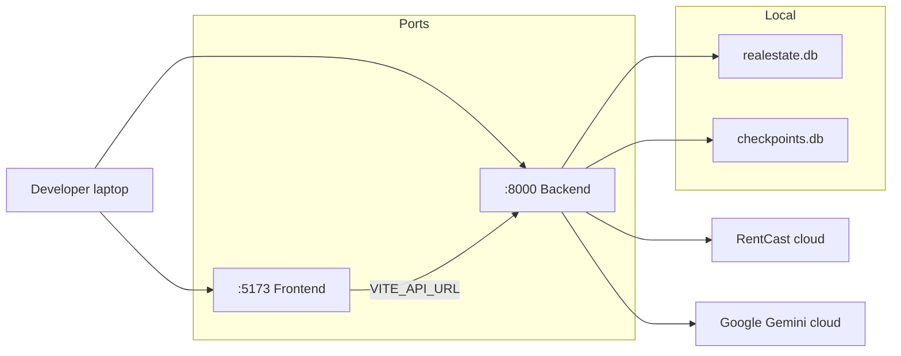

# HomeGuide AI — Architecture & Process Diagrams

Diagrams for the current project: flat `main.py` + `agent.py`, RentCast data, Gemini chat, SQLite, SSE streaming.

---

## 1. System architecture

---

## 2. Project structure

| File | Role |
|------|------|
| `main.py` | FastAPI app, SQLite models, RentCast import, embedding index, search functions |
| `agent.py` | Gemini agent, tools, streams events to frontend |
| `realestate.db` | Listings, zip market stats, embedding vectors |
| `checkpoints.db` | Multi-turn chat memory per `session_id` |
| `frontend/` | Reference chat UI (replaceable) |

---

## 3. Chat process flow

---

## 4. Data import process

**RentCast provides:** listings (address, price, beds, baths, sqft, etc.) + zip-level market stats.

**On import:** each listing gets an embedding (`gemini-embedding-001`) stored in SQLite for vibe/similar search.

---

## 5. Agent tool routing

| User says | Tool used |
|-----------|-----------|
| "Homes in Austin under $800k" | `search_properties` |
| "Modern minimalist condo under 600k in Austin" | `search_properties_semantic` |
| "Same vibe as the 2nd listing" | `find_similar_properties` |
| "Tell me more about listing X" | `get_property_details` |
| "How's the 78723 market?" | `get_neighborhood_info` |

---

## 6. Search types

---

## 7. SSE events to frontend

---

## 8. Deployment view (typical dev)

Remote frontend dev: runs backend locally on their machine **or** points `VITE_API_URL` at a deployed/tunnel URL.

---

## Related docs

- [README.md](README.md) — quick start
- [FRONTEND_HANDOFF.md](FRONTEND_HANDOFF.md) — frontend spec
- [backend/README.md](backend/README.md) — backend setup & import
