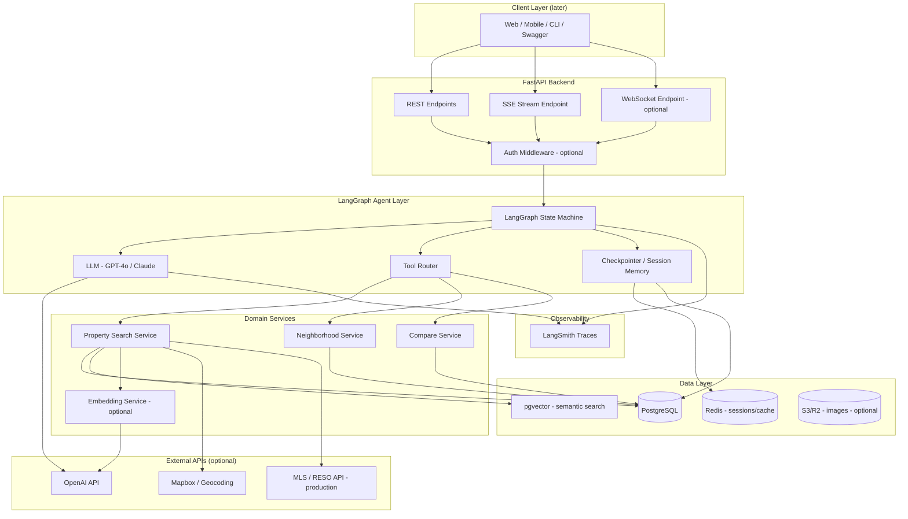
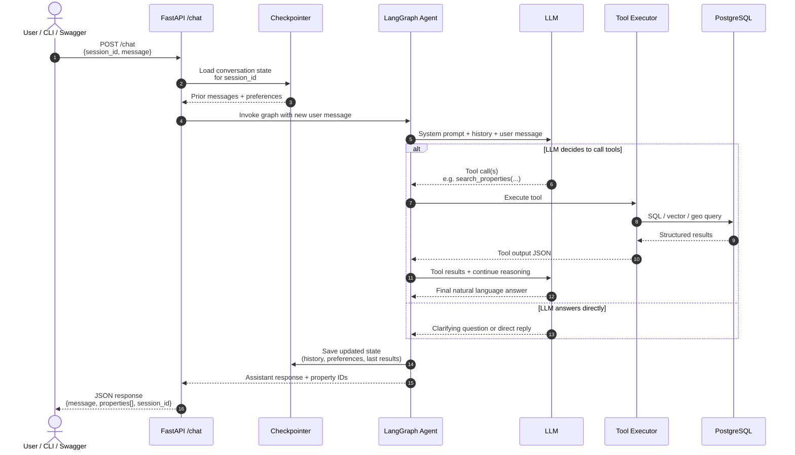
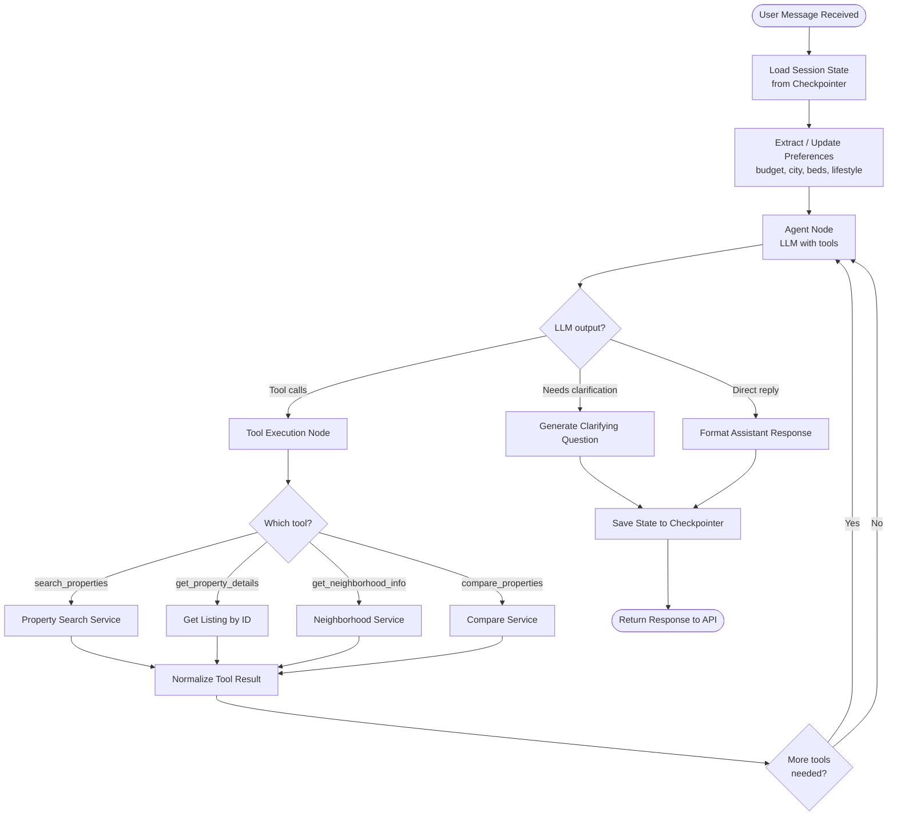
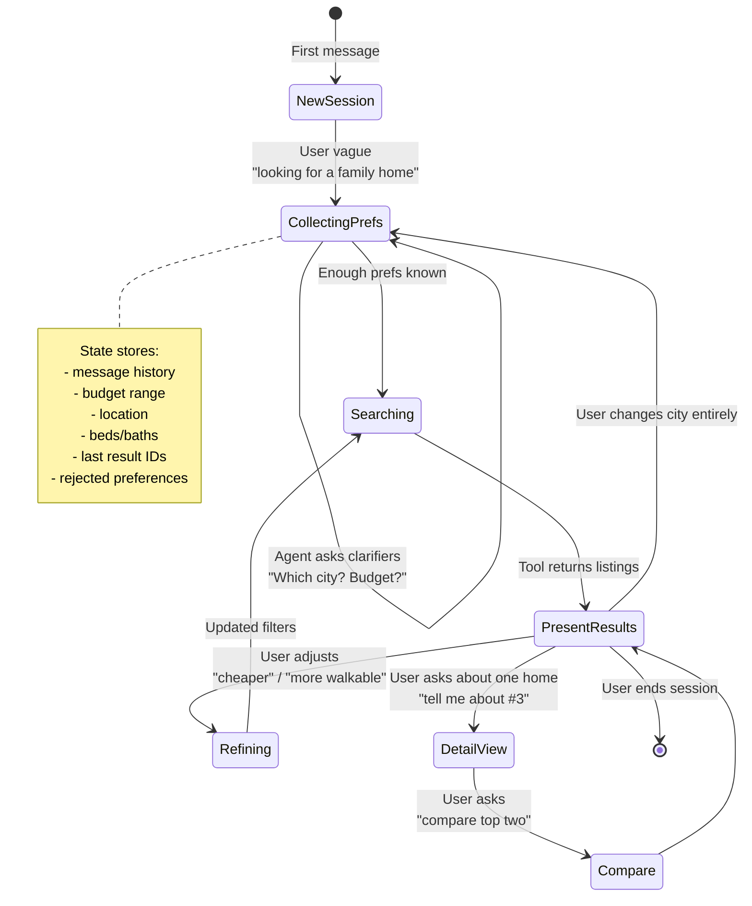
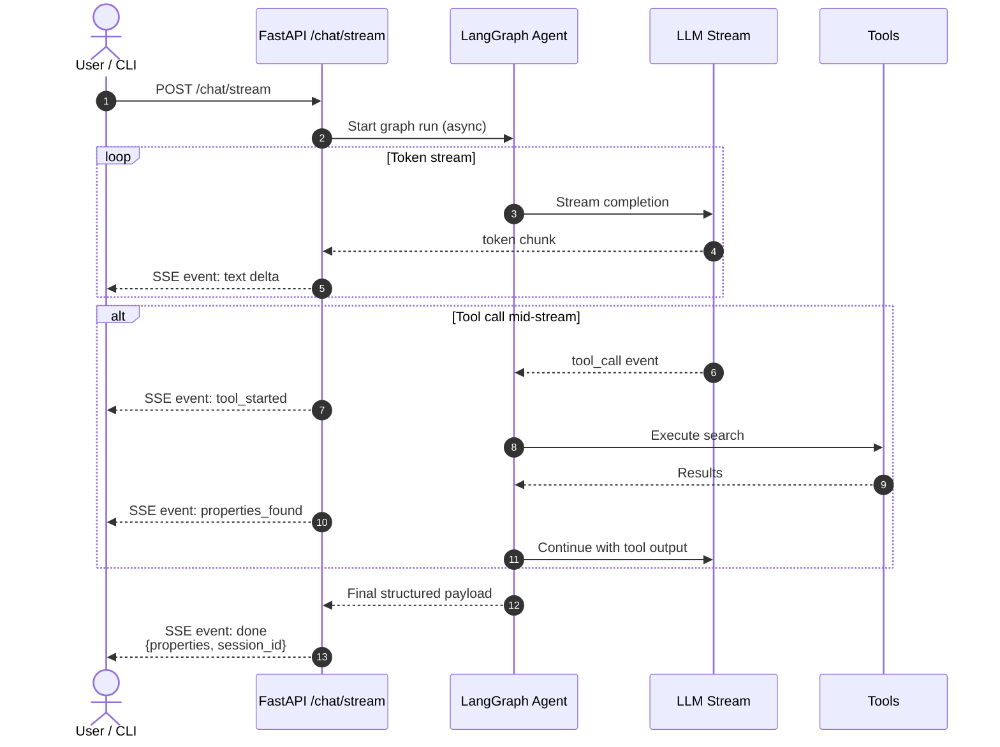
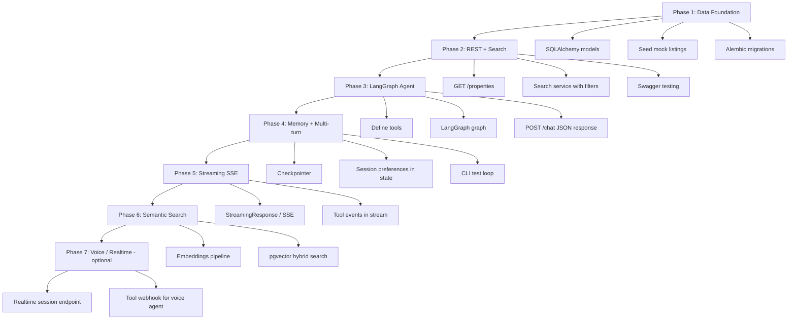
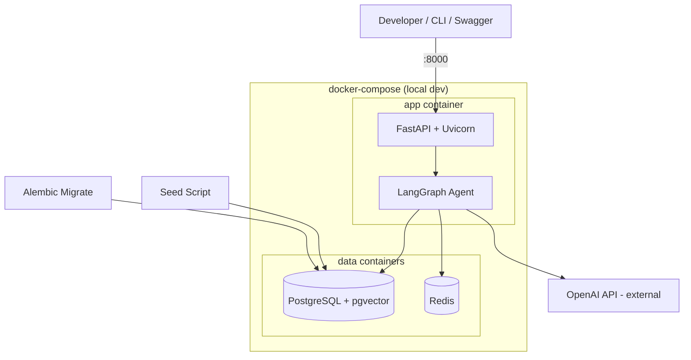
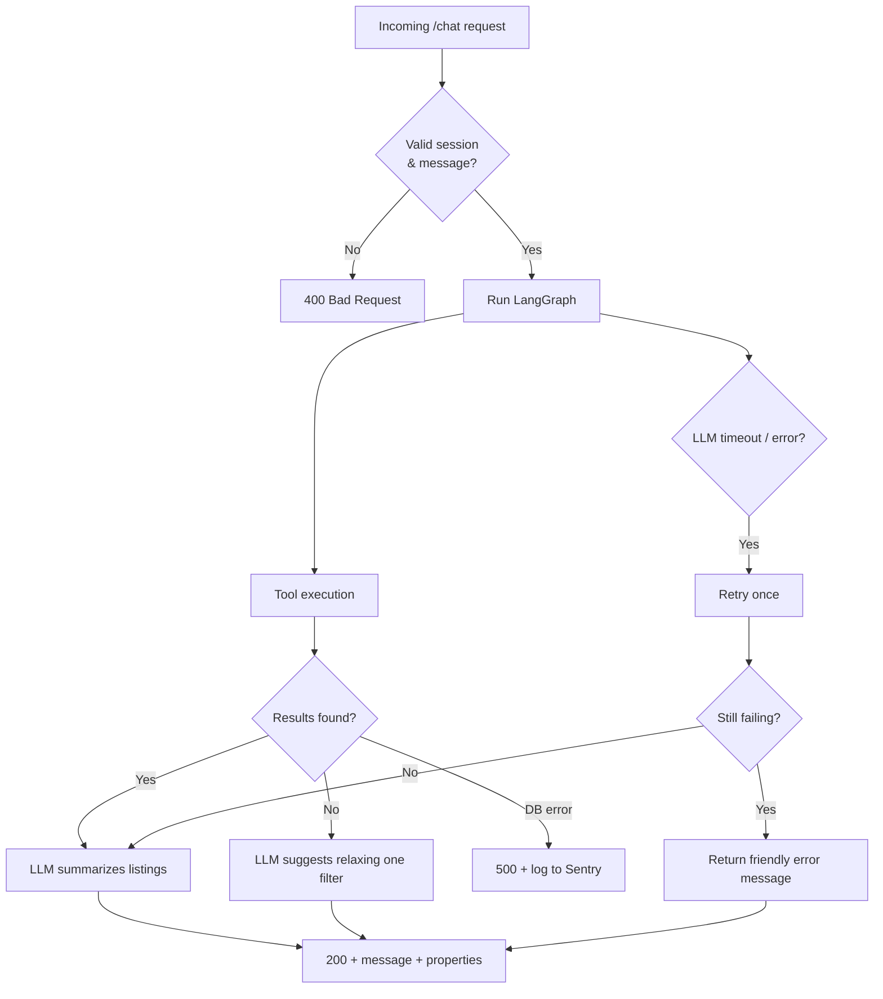

# Homes AI–Style Project — Process Diagrams

Backend-focused process diagrams for building a conversational real estate assistant similar to [Homes.com Homes AI](https://www.homes.com).

These diagrams cover system architecture, request flows, agent logic, search, memory, streaming, deployment, and error handling.

---

## 1. High-Level System Architecture



---

## 2. Main User Chat Flow (Backend Core)

This is the primary loop to build first.



---

## 3. LangGraph Agent Internal Flow

How the agent graph should be structured.



---

## 4. Property Search Tool Flow

What happens inside `search_properties`.

```mermaid
flowchart LR
    Input[Tool Input<br/>city, maxPrice, minBeds,<br/>keywords, neighborhood] --> Validate[Validate & Normalize<br/>Pydantic schema]

    Validate --> ParseNL{Natural language<br/>keywords present?}

    ParseNL -->|Yes| Embed[Generate query embedding]
    ParseNL -->|No| SQLOnly[Structured SQL filters only]

    Embed --> Hybrid[Hybrid Search]
    SQLOnly --> SQL[SQLAlchemy Query]

    Hybrid --> SQL
    Hybrid --> Vector[pgvector similarity search]

    SQL --> Filter[Apply filters:<br/>price, beds, baths,<br/>city, type, status]
    Vector --> Filter

    Filter --> Geo{Location radius<br/>or map bounds?}
    Geo -->|Yes| PostGIS[PostGIS spatial filter]
    Geo -->|No| Rank[Rank & limit results]

    PostGIS --> Rank
    Rank --> Format[Format listing summaries<br/>id, address, price, beds,<br/>neighborhood, highlights]
    Format --> Return[Return JSON to Agent]

    Return --> Agent[LLM interprets results<br/>and writes user-facing answer]
```



---

## 5. Multi-Turn Conversation & Memory Flow

How the agent remembers and refines preferences across turns.



---

## 6. Streaming Response Flow (SSE)

Token streaming without a full frontend.



---

## 7. Backend-Only Development Phases

Suggested build order mapped to the diagrams above.



---

## 8. Docker / Runtime Deployment Flow

How services run together locally.



---

## 9. Error & Fallback Flow

How the backend should behave when things go wrong.



---

## 10. One-Page Summary (ASCII)

```
┌──────────────┐     POST /chat      ┌──────────────┐
│ User / CLI   │ ──────────────────► │   FastAPI    │
│ Swagger      │ ◄────────────────── │   Backend    │
└──────────────┘   JSON / SSE stream └──────┬───────┘
                                            │
                                            ▼
                                   ┌────────────────┐
                                   │   LangGraph    │
                                   │   Agent Graph  │
                                   └───────┬────────┘
                                           │
                         ┌─────────────────┼─────────────────┐
                         ▼                 ▼                 ▼
                    ┌─────────┐      ┌───────────┐     ┌──────────┐
                    │   LLM   │      │   Tools   │     │ Checkptr │
                    │ OpenAI  │      │ search    │     │ SQLite/  │
                    └─────────┘      │ details   │     │ Postgres │
                                       │ neighbor  │     └──────────┘
                                       │ compare   │
                                       └─────┬─────┘
                                             ▼
                                    ┌─────────────────┐
                                    │ Property Search │
                                    │   Service       │
                                    └────────┬────────┘
                                             ▼
                                    ┌─────────────────┐
                                    │   PostgreSQL    │
                                    │ + pgvector      │
                                    └─────────────────┘
```

---

## Recommended Starting Point (Backend Only)

Focus on **Diagrams 2, 3, and 4** first:

1. User sends message → FastAPI
2. LangGraph decides → call tools or ask clarifying questions
3. Tools query PostgreSQL → return structured listings
4. LLM writes the final answer → save session → respond

That gives you the core Homes AI loop without any frontend.

---

## Related Documentation

- [TECH_STACK_LEARNING.md](./TECH_STACK_LEARNING.md) — Full tech stack learning roadmap

---

*Last updated: June 2025*
